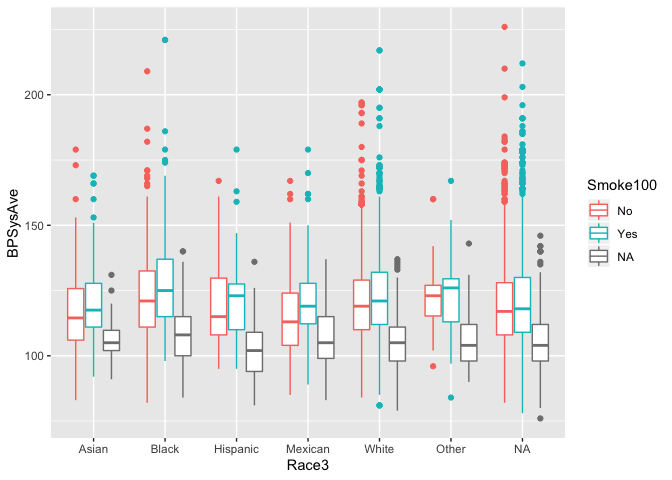

The draft should include the following:

## Research Question 

+ For our project we will be utilizing the NHANES data set as well as the health_coverage data set. The NHANES data set contains verious health related information that help to shed light on the quality of life that an individual has. We aim to use this data to investigate how certain socioeconomic factors play role in quality of health.

## Graphs 

<!-- -->

+ This graph shows the relationship between Systolic Blood pressure of older individuals with Diabetes. As you can see, as individuals get older, they are more likely to have incidence of diabetes as well as a higher blood pressure.

<!-- -->

+ This shows how people of different races are affected by diabetes based on their level of poverty. The lower the y value, the more poverty that the race has on average. 

<!-- -->
<!-- -->
<!-- -->
## Models

```
## # A tibble: 7 x 5
##   term          estimate std.error statistic   p.value
##   <chr>            <dbl>     <dbl>     <dbl>     <dbl>
## 1 (Intercept)     98.0      1.04       93.9  0.       
## 2 Age              0.457    0.0112     40.7  6.66e-306
## 3 Race3Black       5.51     1.16        4.77 1.94e-  6
## 4 Race3Hispanic    1.55     1.30        1.20 2.32e-  1
## 5 Race3Mexican     1.72     1.21        1.42 1.56e-  1
## 6 Race3White       1.46     0.985       1.48 1.40e-  1
## 7 Race3Other       4.07     1.63        2.49 1.27e-  2
```

+ This partial interaction model helps to show how Race and Age interact to affect Systolic Blood Pressure because it helps to shed light on how certain races are more likely to experience an increase in blood pressure (which associated with poorer health). 

+ The intercept represents Asian individuals at the age of 0. The Age coefficient represents the average unit of increase for bloodpressure as individuals get older. As you can see, there is an extremely high p-value, supporting the strong relationship between age and bloodpressure increase. 

+ Race3Hispanic, Race3Mexican, Race3White, coefficients represent the increase of blood pressure for individuals that are Hispanic, Mexican, or White respectively. These coefficients are not dependent on Age and these estimates are purely the average unit of increase for these races. As you can see, the p-value for individuals of these races are very high, meaning that there the liklihood of the Blood Pressure Increase for these indviduals is not likley to be due to their race. 

+ Race3Black coefficient represents the avaerage unit of increase for blood pressure of inidividuals that are Black. As you can see that black individuals have a significantly higher increase of blood pressure, "+5.51", than other races. Furthermore, the p-value of this coefficient is significantly lower, outlining a very strong relationship between an indidual being black and their systolic blood pressure increase. 


```
## # A tibble: 4 x 5
##   term        estimate std.error statistic   p.value
##   <chr>          <dbl>     <dbl>     <dbl>     <dbl>
## 1 (Intercept)  99.1      0.690      144.   0.       
## 2 Age           0.524    0.0161      32.5  6.01e-218
## 3 Poverty       0.354    0.225        1.57 1.16e-  1
## 4 Age:Poverty  -0.0283   0.00503     -5.62 1.97e-  8
```
+ This full interaction model shows how both Age and Poverty interact with each other to affect systolic blood pressure. The data shows how people of higher economic status will have a lower blood pressure on average than those of a lower economic status. 
+ Intercept coefficient represents the average systolic blood pressure when both the age and poverty level is 0.
+ As we've established in previous models and graphs, Age and systolic blood pressure increase are very strongly related. As the p value for the age coefficient is quite miniscule showing a strong relationship
+ The poverty coefficient is the average unit increase depending on the categorical numerical value of poverty. In this integer-based numerical category, 1 is indicative of most poverty stricken and 5 is least poverty stricken. 
+ The Age:Poverty coefficient is the average unit of change of Systolic blood pressure for aging individuals depending on their poverty level. Since the estimate is negative, we can determine that as individuals get older, the less poverty stricken they are (i.e. 5), the more their blood pressure will decrease.


```
## # A tibble: 2 x 5
##   term          estimate std.error statistic  p.value
##   <chr>            <dbl>     <dbl>     <dbl>    <dbl>
## 1 (Intercept)     122.       0.284     428.  0.      
## 2 PhysActiveYes    -4.17     0.380     -11.0 7.58e-28
```


```
## # A tibble: 3 x 5
##   term          estimate std.error statistic  p.value
##   <chr>            <dbl>     <dbl>     <dbl>    <dbl>
## 1 (Intercept)   121.         0.421   288.    0.      
## 2 PhysActiveYes  -4.18       0.398   -10.5   1.33e-25
## 3 Poverty         0.0626     0.118     0.529 5.97e- 1
```


```
## # A tibble: 7 x 5
##   term          estimate std.error statistic  p.value
##   <chr>            <dbl>     <dbl>     <dbl>    <dbl>
## 1 (Intercept)    120.        1.15    104.    0.      
## 2 PhysActiveYes   -5.00      0.540    -9.25  3.50e-20
## 3 Race3Black       5.53      1.36      4.06  4.95e- 5
## 4 Race3Hispanic    0.693     1.53      0.453 6.50e- 1
## 5 Race3Mexican    -1.23      1.44     -0.858 3.91e- 1
## 6 Race3White       3.77      1.15      3.27  1.09e- 3
## 7 Race3Other       3.96      1.96      2.02  4.35e- 2
```


```
## # A tibble: 7 x 5
##   term          estimate std.error statistic   p.value
##   <chr>            <dbl>     <dbl>     <dbl>     <dbl>
## 1 (Intercept)     3.09      0.102     30.3   1.01e-183
## 2 Race3Black     -1.03      0.124     -8.32  1.14e- 16
## 3 Race3Hispanic  -1.11      0.136     -8.17  4.11e- 16
## 4 Race3Mexican   -1.30      0.129    -10.1   8.29e- 24
## 5 Race3White      0.0486    0.106      0.458 6.47e-  1
## 6 Race3Other     -0.708     0.168     -4.22  2.47e-  5
## 7 DiabetesYes    -0.217     0.0894    -2.43  1.53e-  2
```
+ Intercept is for Asians without diabetes. Indivieuals with diabetes in general have an average increase impoverishment (negative estimate) When you factor in race, Black, Hispanics, Mexicans all have an increase in impoverishment (negative estimate), while Whites tend to have a decrease in impoverishment. 

```
## # A tibble: 3 x 5
##   term          estimate std.error statistic  p.value
##   <chr>            <dbl>     <dbl>     <dbl>    <dbl>
## 1 (Intercept)     120.       0.294    411.   0.      
## 2 DiabetesYes       8.89     0.648     13.7  2.37e-42
## 3 PhysActiveYes    -3.56     0.378     -9.41 6.66e-21
```


```
## # A tibble: 4 x 5
##   term                       estimate std.error statistic  p.value
##   <chr>                         <dbl>     <dbl>     <dbl>    <dbl>
## 1 (Intercept)               120.          0.301 400.      0.      
## 2 DiabetesYes                 8.89        0.835  10.6     2.82e-26
## 3 PhysActiveYes              -3.55        0.396  -8.97    3.57e-19
## 4 DiabetesYes:PhysActiveYes  -0.00528     1.32   -0.00399 9.97e- 1
```

## Inferences

+ The number below represents the confidence interval for the intercept of BPSysAve when Age and Poverty are fully interacting.

```
## [1] 0.5653686
```

```
## # A tibble: 1 x 1
##      SE
##   <dbl>
## 1 0.565
```

```
## # A tibble: 1 x 2
##   lower upper
##   <dbl> <dbl>
## 1  98.0  100.
```

```
## [1]  97.97801 100.23949
```
+ Based on the analysis, our hypothesis is that Age affects health quality. We infer that socioeconomic factors (specifically race, poverty, *Physical Activity)  affect health qualtity. Based on our preliminary investigation, we can infer that the health of certain races are more impacted by poverty than others. 


```
## # A tibble: 7 x 2
##   Race3        n
##   <fct>    <int>
## 1 Asian      288
## 2 Black      589
## 3 Hispanic   350
## 4 Mexican    480
## 5 White     3135
## 6 Other      158
## 7 <NA>      5000
```
